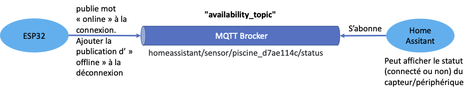
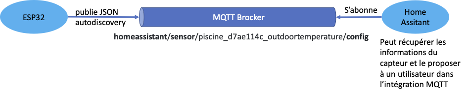
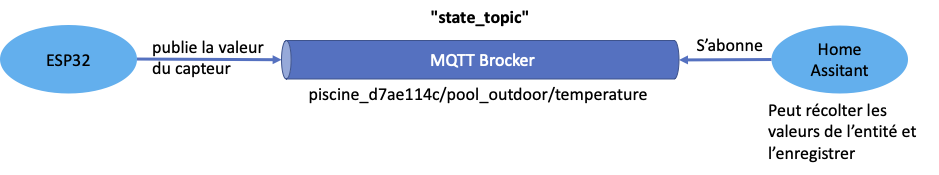
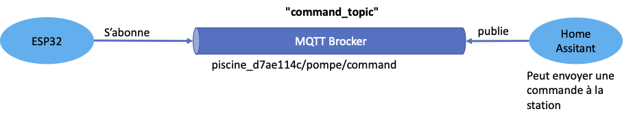

# TP03 - Station météo

**Les consignes sont sujets à modification. Reportez-vous à ce qui est communiqué durant le cours.**

## 1 - Directives

### 1.1 - Déroulement du TP

- La remise du travail doit être effectuée pour le 22 février 23:59 maximum (Présenté en PM, mais remis officiellement avant minuit)
- Le projet est réalisé en équipe de 2 personnes
- Vidéo de 5 minutes illustrant le fonctionnement
- Vidéo promotionnelle de maximum 1 min de votre station
- Les vidéos doivent être déposées sur Youtube avec une option de partage « non listée »
- Vous devez utiliser Git pour gérer vos sources
- Vous devez utiliser SharePoint pour gérer votre document de rapport (Onglet "Fichiers" de votre équipe Teams)
- La structure de votre répertoire racine doit suivre la structure donnée dans le dépôt Git
- Le code source doit être dans le répertoire « src » et suivre la structure d’un projet Platform.io
- Vous devez modifier un fichier README.md contenant :
  - Le prénom, nom et numéro de matricule de chaque personne
  - Le lien de la vidéo sur Youtube
- Documentations détaillées de la station (manuel d’utilisation & documentation technique)
- La remise du travail doit être effectuée sur et à la date indiquée sur la plateforme d'enseignement

### 1.2 - À remettre sur la plateforme d'enseignement Léa

- Un document word contenant le détail du projet
- Votre code source
- Les liens YouTube de vos vidéos de présentation

### 1.3 - Structure de la remise

- Vous devez remplir le fichier "AUTHORS.md".
  Il donne le nom et matricule des équipiers
- Votre code source doit être dans le répertoire  ```src``` du présent dépôt Git
- Le répertoire source doit suivre la structure d’un projet Platform.io
- Vous devez fournir une vidéo de 5 minutes illustrant le circuit, le code et le fonctionnement
- Vous devez aussi fournir une vidéo promotionnelle de votre projet de maximum 1 min
- Pour les vidéos :
  - Elles doivent être déposées sur Youtube avec une option de partage « non listée »
  - Leurs liens doivent être indiqués dans le document word et dans le fichier "AUTHORS.md"
- Le répertoire "documents" doit contenir votre rapport de TP

### 1.4 - Évaluation

L'évaluation du travail est effectuée par les enseignants de l'UE en se basant sur :

- L'historique de Git et de Teams/Sharepoint font office de référence pour évaluer la proportion du travail effectué par chaque équipier

- La qualité et le contenu du code source :

  - Conformité du code et des normes d'écriture utilisées dans le cours
  - Fonctionnalité du code
  - Facilité de lecture du code
  - Modularité
  - Modèle objet
  - Paramétrisation du code
  - Utilisation de constantes
  - Utilisation de fichiers de configuration
  - etc.

- La qualité et le contenu du document word :
  
  - Français
  - Schéma
  - Clarté et précision des explications
  - Mise en page
  - Page de présentation
  - etc.

- La qualité et le contenu de la présentation vidéo :

  - Vidéo
  - Audio
  - Explication orale
  - etc.

Tout partage de code, d'explication, de bouts de texte, etc. est considéré comme du plagiat. Pour plus de détails, consultez le site (et ses vidéos) [Sois intègre du Cégep de Sainte-Foy](http://csfoy.ca/soisintegre) ainsi que [l'article 6.1.12 de la PÉA](https://www.csfoy.ca/fileadmin/documents/notre_cegep/politiques_et_reglements/5.9_PolitiqueEvaluationApprentissages_2019.pdf)

## 2 - Description du projet

Le regroupement « les hackers de Québec » désire créer un modèle de station météo facile à concevoir, accessible à tous et à utiliser.

Minimalement, la station météo doit être capable de collecter les données de température, pression atmosphérique et humidité. Elle doit être capable de se connecter sur un réseau Wifi afin de pouvoir envoyer les données collectées dans courtier de messages de type MQTT. Les données doivent être récupérées et exploitées dans le logiciel de domotique Homeassistant (https://www.home-assistant.io).

**Durant la conception de votre station météo, vous avez eu votre "Eurêka" ! Vous avez un meilleur projet à développer qu'une simple station météo et vous décidez de la mettre en oeuvre au travers d'un prototype fonctionnel proche du produit final. Ce produit sera présenté aux pré-sélections des Dragons afin d'obtenir un financement.**

Pour ce projet, vous devez utiliser le matériel et technologies suivantes :

- ESP32
- Wifi
- BME280
- MQTT
- Un logiciel de domotique
- WifiManager
- Git (Github / Azure DevOps / GitLab du Cégep) : adresse à communiquer à vos enseignants.


## 3 - Description détaillée du document à remettre

Le document word doit décrire le contexte du projet, sa planification, la répartition des tâches avec un registre des heures passées, les schémas du montage, les diagrammes UML pertinents ainsi que l'inventaire des composants et une estimation des coûts.

La structure du document comprend :

- Préparation du projet : (20%)
  - Contexte du projet
  - Planification, attribution des tâches
  - La forme pourra être un texte explicatif ou un schéma hiérarchique des différentes étapes du projet
  - Diagramme structurel ou de classes
  - Inventaire des pièces : estimation des coûts des pièces
  - Estimation énergétique : durée de vie des batteries / consommation si sur secteur
  - Schéma technique avec explications

- Registre des heures consacrées au projet (5%)
Le registre doit indiquer la répartition des tâches. Si le travail est fait en équipe, le registre doit montrer les tâches respectives que chaque personne aura fait avec le nombre d’heures par tâche.
- Vidéo de 5 minutes illustrant le fonctionnement (15%)
  - Présentation rapide du circuit
  - Présentation rapide de la structure du code et des choix de conception
  - Présentation du fonctionnement

- Code (20%)
  - Bon fonctionnement du programme
  - Respect des bonnes pratiques
  - Modularité et utilisation adéquate de la POO
  - Optimisation de la mémoire

- Produit d’une qualité de type production (hors montage qui est un prototype) (20%)
  - Manuel d’utilisation
  - Facilité de configuration
  - Consommation électrique

- Créativité (15%)
  - Fonctionnement des ajouts
  - Originalité des ajouts
  - Utilité des ajouts

- Présentation orale (5%)

Le code doit être fourni sous la forme d’un projet « Platform.IO » bien structuré.

## 4 - Idées d'extensions

- Affichage des données sur la station (LCD, 7 segments, etc.)
- Affichage du confort par rapport à la température et taux d’humidité
- Affichage température ressentie
- Affichage des prévisions de la journée
- Contrôle d’un périphérique qui simulerait un arrosage automatique (ex. DEL qui s’illumine pour simuler l’arrosage en cours)
- Enregistrements hors connexion

## 5 - Références

- [Wifi manager](https://github.com/khoih-prog/ESP_WiFiManager)
- [Courtier MQTT documentation officielle de mosquitto](https://mosquitto.org)
- [Bibliothèque client MQTT pour ESP32](https://github.com/knolleary/pubsubclient) - [Documentatin de l'API](https://pubsubclient.knolleary.net/api)
- [Home assistant](https://www.home-assistant.io)
  - [Courtier mosquitto (MQTT) pour Home assistant](https://www.home-assistant.io/docs/mqtt/broker)
- [Autodiscovery](https://roelofjanelsinga.com/articles/mqtt-discovery-with-an-arduino/)
- [MQTT Sensor + availability topic](https://www.home-assistant.io/integrations/sensor.mqtt/)
- [Économie d’énergie](https://lastminuteengineers.com/esp32-sleep-modes-power-consumption/)

## 6 - Quelques bouts de code qui pourraient vous servir

Le flux idéal de votre programme devrait être le suivant :

- Connection à votre réseau Wifi
- Connection à votre courtier MQTT avec un testament (will) pour indiquer que votre périphérique est indisponible avec le message "offline" dans le topic de disponibilité `homeassistant/sensor/<identifiant_materiel>/status`
- Envoi du message de disponibilité pour indiquer que votre périphérique est disponible dans le topic de disponibilité `homeassistant/sensor/<identifiant_materiel>/status`


- Envoi du message de découverte pour chaque capteur avec le sujet `homeassistant/sensor/<identifiant_materiel>_<identifiant_capteur>/config`


- En boucle : envoi des données du capteur dans le sujet `homeassistant/sensor/<identifiant_materiel>_<identifiant_capteur>/state`


Vous avez aussi la possibilité de déclarer des actionneurs. Dans ce cas, l'ESP32 doit aussi s'abonner à un sujet pour recevoir les commandes. Le sujet est de la forme `homeassistant/<type>/<identifiant_materiel>_<identifiant_capteur>/set` (Voir documentation pour plus de détails).


En résumé :

| Type de message | Sujet | Contenu | Clef autodiscovery |
| --- | --- | --- | --- |
| Disponibilité | `homeassistant/sensor/<identifiant_materiel>/status` | `online` ou `offline` | "availability_topic" |
| Découverte | `homeassistant/sensor/<identifiant_materiel>_<identifiant_capteur>/config` | JSON | N/A |
| Valeur | `homeassistant/sensor/<identifiant_materiel>_<identifiant_capteur>/state` | Valeur | "state_topic" |
| Commande | `homeassistant/<type>/<identifiant_materiel>_<identifiant_capteur>/set` | Valeur | "command_topic" |

### 6.1 - Testament (Will)

Lors d'un connexion à MQTT, vous pouvez spécifier un testament. Ce testament consiste à envoyer un message dans un sujet (topic) au moment de la déconnexion. Ce mécanisme peut être utilisé afin de savoir si votre périphérique est disponible (connecté). En résumé, une fois la connexion configurée avec le testament, vous envoyez un message indiquant que le périphérique est disponible (même topic que le testament). À la déconnexion, MQTT va envoyer le message configuré dans le testament pour indiquer l'indisponibilité du périphérique.

Pour un périphérique de type capteur, le sujet a utiliser est `homeassistant/sensor/<identifiant>/availability`.

Exemple :

```cpp
if (this->m_client->connect(Configuration.getClientId().c_str(),
                            Configuration.getMqttUser().c_str(),
                            Configuration.getMqttPassword().c_str(),
                            Configuration.getMqttWillTopic().c_str(), 0,
                            true, "offline")) {
  this->publish(Configuration.getMqttWillTopic().c_str(),
                          "online");
  Logger.infoln(String(F("MQTT: Connected to MQTT server.")));
} else {
  Logger.errorln(String(F("MQTT: Failed to connect to MQTT server.")));
}
```

### 6.2 - Autodiscovery

À la place de modifier le fichier de configuration YAML d'Home assistant, vous pouvez utiliser la fonctionnalité d'auto découverte de périphérique. Pour rendre votre périphérique découvrable, vous devez envoyer un message JSON qui indique ses caractéristiques.

Voici un exemple de JSON :

```JSON
{
  "availability_topic": "homeassistant/sensor/piscine_d7ae114c/availability",
  "device": {
    "identifiers": "d7ae114c",
    "manufacturer": "PFL Technology",
    "model": "Pool Monitoring PMSE01 v0.1",
    "name": "Pool Monitoring System",
    "sw_version": "f76f4640798cf77257362636b100103d"
  },
  "device_class": "temperature",
  "unique_id": "pool_monitoring_d7ae114c_pool_outdoortemperature",
  "name": "pool_outdoor_temperature",
  "unit_of_measurement": "°C",
  "state_topic": "homeassistant/sensor/piscine_d7ae114c/state",
  "platform": "mqtt"
}
```

La partie device vous permet de décrire l'appareil qui contient le capteur. Cette partie est commune à tous les capteurs de l'appareil. La partie contenu décrit le capteur. Cette partie est unique par capteur. Vous pouvez ajouter des champs supplémentaires si vous le désirez (Voir documentation d'Home Assistant).

Afin d'utiliser l'autodiscovery, vous devez envoyer des messages longs. Si le message ne s'envoie pas, c'est que vous avez dépassé la limite du tampon du client MQTT. Pour modifié cette valeur, vous pouvez utiliser la méthode `setBufferSize`. Généralement, une valeur de un kilo devrait être suffisante (`this->m_client->setBufferSize(1024)`)

Ce type de messages est à envoyer dans un sujet avec le format suivant (topic) : `homeassistant/sensor/piscine_d7ae114c_outdoortemperature/config` par type de mesure. `piscine_d7ae114c_outdoortemperature` est ici un identifiant unique pour la mesure. Si vous avez plusieurs type de mesure, comme sur le BME280, il faut un sujet et message par type de mesures. Si vous avez plusieurs périphérique, vous devriez ajouter l'identifant de périphérique dans le sujet de l'état (ici `piscine/pool_outdoor/temperature` pourrait être `piscine_d7ae114c/pool_outdoor/temperature`).
  
Toujours dans cet exemple, le sujet de disponibilité pourrait être `homeassistant/sensor/piscine_d7ae114c/status`.
  
Exemple de génération d'identifiant "unique" pour ESP32 :
  
```cpp
String getMachineId() {
  uint32_t macPart = ESP.getEfuseMac() & 0xFFFFFFFF;
  return String(macPart, HEX);
}
```

Plus de détail sur les champs : https://www.home-assistant.io/integrations/sensor.mqtt/
